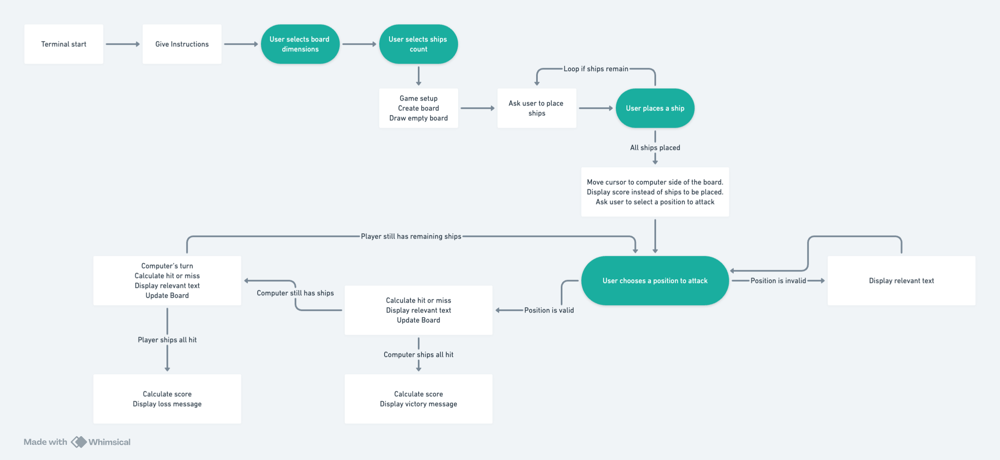

# BattleshipCLI

Welcome to BattleshipCLI, the fully terminal based implementation of the classic Battleships, you can play the game on the web deployment in your browser, which at least works on Chrome. You can also run the game locally by downloadin the run.py file and running it with Python (should be compatible with any 3.x version, developed and tested with 3.11.7)

## Introduction

BattleshipCLI is a web application that lets users enjoy a chance-based, single-user game against the computer online. BattleshipCLI is based on the classic board game (or pen and paper game) mostly known as Battleships (The first iteration was called something else: [See Wikipedia for the fascinating history](https://en.wikipedia.org/wiki/Battleship_(game))).

Game flow:

* The user picks how big of a game board they want and the amount of ships for each player.
* For the rest of the game the player uses the keyboard controlled cursor to select positions on the board. The cursor is controlled 
* The user selects where on the board they want their ships.
* The player picks a position on the computer's side of the board to attack, if a ship is hit it will be displayed as an 'X', if no ship is hit that position will be marked with a '0'.
* After the player's turn is finished the computer's turn is simulated and a position on the player's side of the board is picked at random, similar to the player's turn the players ships are changed into the 'X' symbol if they are hit.
* This is repeated until all ships on any side has been hit.
* If at any time all of the ships on any side has been hit the game ends and the winner is decided and a victory or loss message is displayed to the player depending on if they won or lost the game.
* The player is offered to play again. If they choose to play again the game starts over from the game size selection step.

## Flowchart

## Features

* Battleship game playable against the computer in a terminal.
* Consistent and frequently updating terminal screen for intuitive display and clear visual feedback on the game status.
* Variable size game board to allow for different styles of game, selected by the player at the start. The game board can be anywhere from 3x3 to 10x10.
* Variable amount of ships per game, the player chooses how many ships there should be, it's possible to fill the entire board with ships or have just one per side (1 to 100 ships)!
* The board is split into two parts by a dividing line, the upper half holds the computer's ships which are invisible to the player until hit. The lower half is the player's side where they can place their ships. The players ships are shown with a '§' symbol.

### Existing Features

- __Feature 1__

- # WIP

- __Feature 2__

- # WIP

### Future Features

* Ships longer than one tile
* Limited ability to put a radar beacon instead of shooting, maybe two shots per game or with cooldown. Showing distance to nearest ship from one point on the board, making the game more interesting.
* AI that can act on above two features intelligently. Maybe an easy mode where it makes mistakes.
* Two player mode.

## Testing

### W3C Validator Testing

__All Python code has been tested with the ... .__
# WIP

see [TESTING.md](TESTING.md) for more discussion.
# WIP

### Accessibility Test

see [TESTING.md](TESTING.md) for all details and a full list of scores and other tests performed.

### Solved Bugs

* Running the game locally worked without problems but when deployed to Heroku there was an exception thrown from curses from the curses.set_curs() function. The issue stems from the terminal emulator (xterm) not supporting different kinds of cursor visibility. To work around this issue all uses of that function was removed since it's not crucial for the game to work.

### Known Bugs

* Sometimes there will be a briefly visible terminal cursor in places where they should not be in the middle of game play, such as just outside the bottom right corner of the board or following any status update text. This is caused by the screen frequently updating and sometimes showing the cursor when it's used by the program to input characters, this was previously avoided by using curses.set_curs() to make the cursor invisible when not controlled by the user. Turn out this function does not work on the xterm terminal.

## Deployment

- The game was deployed on [Heroku](http://www.heroku.com/). Here's how to deploy on Heroku:
  - 

The live link can be found here - https://krnils-app-b3ee567503b8.herokuapp.com

## Credits

### Content

- The game itself is based on the old board game: [Wikipedia article](https://en.wikipedia.org/wiki/Battleship_(game)).

### Code

All code is written from scratch, some solutions were inspired by the resources listed below.

- Some coding solutions were inspired by the Code Institute [Love Sandwhiches](https://github.com/Code-Institute-Solutions/love-sandwiches-p5-sourcecode/tree/master/05-deployment/01-deployment-part-1) project 
- [The curses package](https://docs.python.org/3/library/curses.html), from the standard Python library, was used extensively.
- The how to document at https://docs.python.org/3/howto/curses.html, was the main source for coding help.
- [This Stackoverflow Entry](https://stackoverflow.com/questions/2058925/how-can-i-break-up-this-long-line-in-python) For suggestions on how to break up lines within long strings inside Python code.

### Tools

- [VS Code](https://code.visualstudio.com/) The IDE I used for 100% of code writing and majority of README writing.
- [http://ecotrust-canada.github.io/markdown-toc](http://ecotrust-canada.github.io/markdown-toc) table of contents generated with markdown-toc 
- [https://whimsical.com/](https://whimsical.com/) For the flowchart, really easy to use flowchart tool.
# WIP!